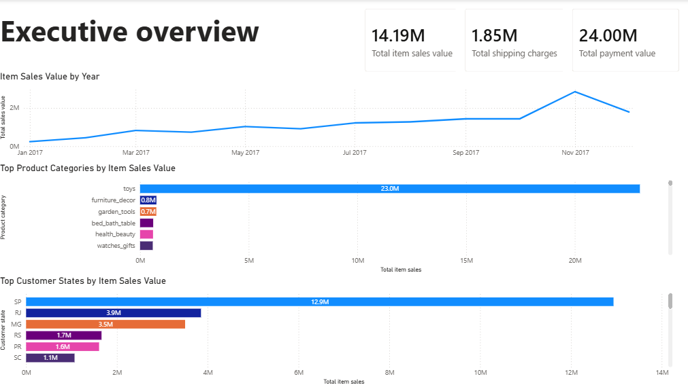
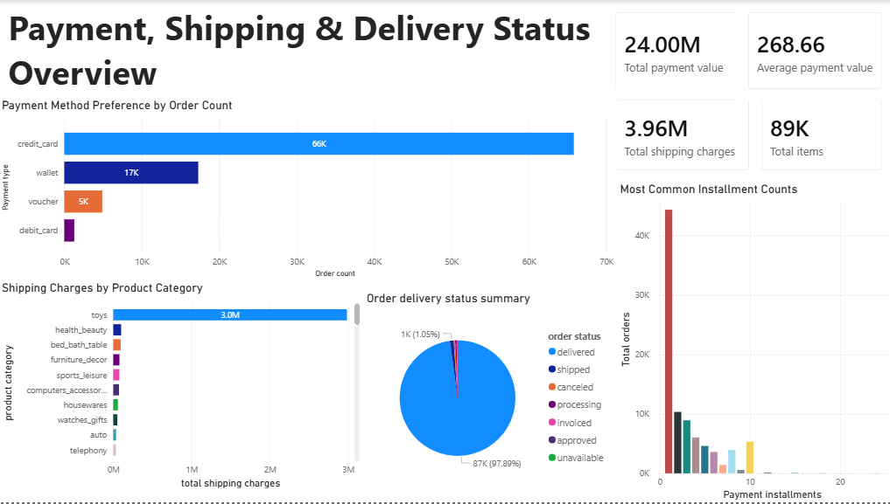

# E-Commerce Order, Payment and Shipping Analysis

## Project Overview

This project analyzes a multi-table e-commerce dataset covering customers, orders, order items, payments, and products.

The project demonstrates a complete data workflow: auditing raw CSV files with Python and pandas, cleaning duplicated and missing product data, validating table relationships, loading the cleaned data into MySQL, using SQL to answer business questions, and presenting the results in Power BI.

Unlike a simple one-table analysis, this project required checking how multiple business tables connect and deciding how to treat financial fields that did not reconcile exactly.

## Executive Summary

- Total item sales value was **30.45M**, while total payment value was **24.00M** and total shipping charges were **3.96M**. These metrics were analyzed separately because they did not reconcile exactly.
- The **toys** category was the strongest product category by item sales value and shipping charges, making it the main category driver in this dataset.
- **SP** was the highest-performing customer state by item sales value, showing a strong concentration of customer activity in that region.
- Credit card was the most common payment method by order count, indicating it was the dominant customer payment preference.
- Most orders were marked as delivered, suggesting a high delivery completion rate, although delivery time and customer satisfaction data would be needed for deeper fulfillment analysis.

## Business Questions

This analysis focuses on the following questions:

- Which product categories generate the highest item sales value?
- Which customer states and cities contribute the most item sales value?
- Which payment methods are most commonly used by customers?
- How are payment installment counts distributed?
- Which product categories contribute the highest shipping charges?
- What is the overall order delivery status distribution?
- How do item sales value and shipping charges trend over time?

## Tools Used

- Python / pandas
- Jupyter Notebook
- SQL / MySQL
- MySQL Workbench
- Power BI
- Markdown
- AI-assisted reporting

## Dataset Structure

The raw data was provided across five CSV files:

- `df_Customers.csv`
- `df_Orders.csv`
- `df_OrderItems.csv`
- `df_Payments.csv`
- `df_Products.csv`

The cleaned tables used in the analysis were:

- `customers`
- `orders`
- `order_items`
- `payments`
- `products`

## Data Cleaning Process

The data was audited and cleaned using Python and pandas. Key steps included:

- Loaded all raw CSV files into separate pandas DataFrames.
- Audited each table for shape, missing values, duplicate rows, and sample records.
- Investigated duplicated product records and confirmed duplicated product IDs had consistent attributes.
- Reduced the product table to one record per product ID.
- Filled missing product category values with `unknown`.
- Retained missing product dimension values where there was insufficient evidence to impute them accurately.
- Converted order timestamp fields into datetime format.
- Flagged delivery-related data quality issues, including delivered orders with missing delivery timestamps and canceled orders with delivery timestamps.
- Validated numeric payment, price, and shipping fields for correct data types and negative values.

## Data Validation Summary

Relationship checks were performed in SQL after loading the cleaned tables into MySQL.

Validation confirmed:

- All orders had matching customer records.
- All order items had matching order records.
- All order items had matching product records.
- All payment records had matching order records.
- No orphaned records were found in the core table relationships.

A small data quality issue was found in the payments table: **3 payment records had `payment_installments = 0`**. These records were flagged for review instead of being overwritten, because the dataset did not provide enough information to confirm the correct value.

## SQL Analysis

The SQL analysis was written in [`sql/ecom_business_analysis.sql`](sql/ecom_business_analysis.sql).

The analysis produced the following output tables:

- `financial_metric_summary.csv`
- `product_category_performance.csv`
- `customer_state_performance.csv`
- `top_customer_cities.csv`
- `payment_method_performance.csv`
- `payment_installment_behavior.csv`
- `shipping_charges_by_category.csv`
- `shipping_weight_by_category.csv`
- `shipping_volume_by_category.csv`
- `monthly_item_sales_trend.csv`
- `order_status_summary.csv`
- `suspicious_payment_installment_records.csv`

## Dashboard Preview

### Executive Overview

### Payment, Shipping & Delivery Status Overview

## Key Findings

### Product Category Performance

The toys category generated the highest item sales value and also contributed the highest total shipping charges.

This suggests that the toys category is the primary value driver in the dataset. However, additional data such as profit, discount, stock levels, and customer demand would be needed before making pricing or inventory recommendations.

### Customer Geography

Customer activity was concentrated by location, with SP generating the highest item sales value among customer states.

State-level analysis provides a regional overview, while city-level analysis provides more specific location detail for operational or marketing decisions.

### Payment Behavior

Credit card was the most commonly used payment method by order count.

Payment method preference was analyzed using order count because it reflects customer choice frequency. Total payment value and average payment value were also reviewed as supporting metrics to understand financial contribution.

### Shipping Charges

Shipping charges were highly concentrated in a small number of product categories, especially toys.

Shipping weight and volume were also analyzed as supporting checks, but these were treated as deeper operational context rather than main dashboard visuals.

### Delivery Status

Most orders were marked as delivered.

This suggests a high delivery completion rate, but delivery time, late delivery rate, and customer satisfaction data would be required to fully evaluate fulfillment quality.

## Power BI Dashboard

The Power BI dashboard is saved in [`powerbi/ecom_analysis_dashboard.pbix`](powerbi/ecom_analysis_dashboard.pbix).

The dashboard contains two pages:

### Page 1: Executive Overview

This page summarizes overall e-commerce performance using:

- Total item sales value
- Total payment value
- Total shipping charges
- Item sales trend by year
- Product category performance
- Customer state performance

### Page 2: Payment, Shipping & Delivery Status Overview

This page provides a deeper view of operational behavior using:

- Payment method preference by order count
- Shipping charges by product category
- Payment installment behavior
- Order delivery status distribution
- Payment and shipping KPI cards

The dashboard visualizes SQL-generated summary outputs. It is designed as a clear reporting dashboard for business insights rather than a fully relational live Power BI model. A future Power BI-focused project can extend this work using direct database connections, relationships, DAX measures, and scheduled refresh.

## AI-Assisted Reporting

AI was used as a writing assistant to summarize verified SQL outputs and improve the clarity of the executive summary. The prompt was designed to restrict the AI to provided metrics only and reduce unsupported assumptions.

The AI summary prompt is documented here: [`notes/ai_summary_prompt.md`](notes/ai_summary_prompt.md).

Final interpretation, recommendations, and business conclusions were manually reviewed.

## Limitations

- Item sales value, payment value, and shipping charges did not reconcile exactly, so they were analyzed as separate metrics.
- Product IDs were not business-friendly, so product category was used for client-facing analysis.
- The dataset did not include profit, discount, customer satisfaction, marketing campaign, stock level, or return data.
- Missing product dimensions were retained where there was insufficient evidence to impute accurate values.
- The Power BI dashboard uses SQL summary outputs, so it is not intended to function as a fully interactive relational model.

## Final Deliverables

This project produced:

- Cleaned CSV datasets
- Jupyter Notebook cleaning workflow
- MySQL relationship validation queries
- SQL business analysis queries
- Exported SQL analysis outputs
- Power BI dashboard
- AI-assisted executive summary prompt documentation
- Portfolio README summary

## Conclusion

This project demonstrates a multi-table data analysis workflow using Python, SQL, and Power BI. The analysis shows how raw e-commerce data can be cleaned, validated, analyzed, and translated into business-facing insights while documenting data quality issues and using AI responsibly as a reporting assistant.

